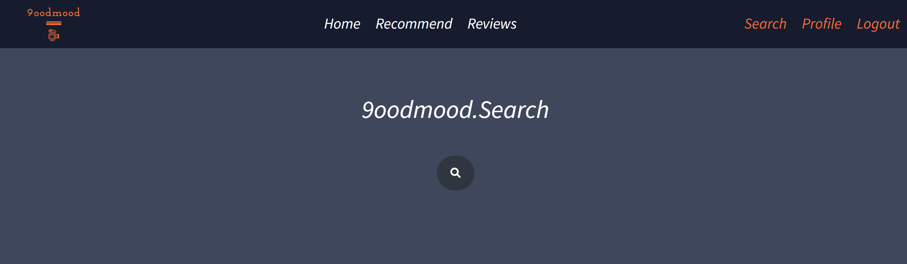

# 1. 팀

박정현, 배준식

---

# 2. 개발 환경

- Django 3.2.12
- Vue

---

# 3. 프로젝트 구조

### 3.1 ERD

### 

### 3.2 Component

### 

---

# 4. Overview

- **4.1 Home**

  - **main page**

  - 
  - **detail page** (영화의 상세정보를 클릭하면 해당 영화의 소개와 함께 트레일러를 볼 수 있는 화면이 뜸)
  - 
  - 

- **4.2 Community**

  - **리뷰 목록**
  - 
  - **리뷰 작성**
  - 
  - **리뷰 상세**
  - 

- **4.3 Search**

  - **검색 메인** (돋보기를 호버하면 검색어를 넣을 수 있는 상자가 활성화)
  - 
  - 
  - **검색 결과** (검색어를 입력하면 해당 검색어를 제목에 포함하고 있는 영화의 포스터가 쭉 뜸. 그 포스터를 호버하면 줄거리와 함께 detail page로 넘어갈 수 있는 버튼이 뜸)
  - 

- 4.4 Movie Recommend

  - 1. **조별리그** (16개의 영화를 랜덤으로 받아와 4개의 그룹으로 나눈다. 각 그룹당 2개씩의 영화를 선택해 다음 단계로 올려보낼 수 있다)
  - 
  - 1.1 장바구니 상세 (영화를 클릭하면 장바구니에 영화가 담긴다. 담긴 영화는 장바구니를 호버함으로써 확인할 수 있다)
  - 1.1.1 장바구니 비호버시(그냥 우측 하단에 동그란 아이콘이 고정되어 있음)
  - 
  - 1.1.2 장바구니 호버시(장바구니가 열리며 선택된 영화의 목록이 뜸)
  - 
  - 2. **토너먼트**
  - 다음과 같이 1대1 매치업의 형태이다. 영화 두개중 하나를 선택하면, 선택중인 영화가 위에 표시된다. 모든 매치업에 대하여 영화를 클릭했으면 다음 단계로 넘어갈 수 있다.(8강, 4강은 같은 로직)
  - 
  - 3. **결승전**
  - 
  - 
  - 호버시 색이 바뀌며 영화의 상세정보를 볼 수 있음
  - 

---

# 5. 느낀점

인생 첫번째 프로젝트였다. 이번 프로젝트를 통해 많은 것을 배웠다.

1. 깃의 활용

   - 푸시와 풀 정도밖에 할 줄 몰랐는데, 이번 프로젝트를 계기로 해서 브랜치 기능을 사용할 수 있게 되었다

2. vue에 대한 이해

   - vue를 이용해 영화 추천 프로그램을 짰다. 조별리그, 토너먼트를 거쳐 하나의 영화를 선택하는 로직을 짜는 과정은 굉장히 재미있는 경험이었다. 프론트의 재미가 이런걸까? 내가 짜는 코드의 결과가 직접적으로 보이니 동기부여도 되고, 흥미도 붙었다. 며칠 전까지만 해도 데이터 prop emit하는데 급급했는데, 이제 어느정도 데이터를 store에 저장하고 원하는곳에 원하는 모양으로 불러오는 방법을 깨달은 것 같다. 생각보다 별 거 없다는 생각이 들었다

3. django serializer

   - rest api를 이용해 백을 짰다. serializer를 이용해 어떤 형태의 데이터를 프론트에게 전달해줄 지 고민하는 과정이 백에 대한 이해가 부족했던 나에겐 큰 도움이 되었다.

4. api로 데이터를 요청, db에 저장하는 과정

   - 그렇게 어려운 과정은 아니었으나, 처음 해보는 작업이었기에 살짝 시간이 걸렸다. 특히 many to many로 선언된 필드의 경우, 어떤 방식으로 json의 모양을 짜야 하는지 고민이 살짝 되었다. 그러나 극복, 그것이 나, 박 정 현

5. 호버의 재미

   - 호버시 ~~한 효과를 주는 과정이 얼마나 재미있는지... 나도 모르게 거의 모든 효과를 호버로 줘버리고 말았다. 후회는 없다

6. 처음엔 걱정이 많이 되었다. 시간안에 다 할 수 있을까? 이런 부분을 구현할 수 있을까? 등 등... 그러나 목표로 한 대부분의 기능을 구현하는데 성공했고, 완성도도 나쁘지 않게 잡힌 것 같아 만족스럽다.

   한주간 팀원분과 함께 매일 10시간 이상을 코드만 짰다. 그런데 딱히 힘들다는 생각이 들지 않았다. 뭔가 중반부터는 재미를 조금씩 느끼게 되었다. 이번 한주간의 경험을 통해 다음 단계로 넘어갈 수 있겠다는 자신이 생겼다.
